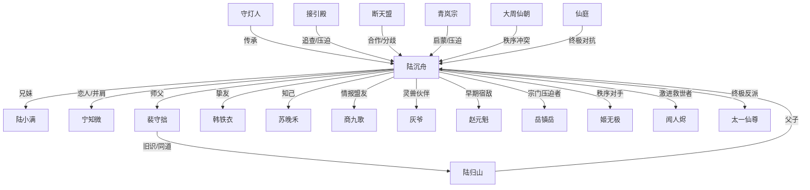

# 《照骨问仙》人物关系图

> 用于快速查看主角、伙伴、师长、反派与隐藏势力之间的关系。

---

## 关系说明

### 主角阵营
- **陆沉舟**：核心主角。
- **陆小满**：妹妹，后期成长为阵法师。
- **宁知微**：女主，执法者，后与主角共同建立新秩序。
- **韩铁衣**：炼器与组织型人才。
- **苏晚禾**：丹道与民生线核心。
- **商九歌**：情报、交易、灰色行动担当。
- **灰爷**：灵兽伙伴，负责空间与缓冲气氛。

### 师长线
- **裴守拙**：精神导师，决定主角一生看待“代价”的方式。
- **陆归山**：父亲，牵出守灯人与道兵线。

### 反派/对手线
- **赵元魁**：早期镜像型对手。
- **岳镇岳**：妥协型掌门。
- **姬无极**：秩序型强权人物。
- **闻人烬**：激进救世者。
- **太一仙尊**：终局理念对手。

---

*可直接作为人物设定总控图使用。*
