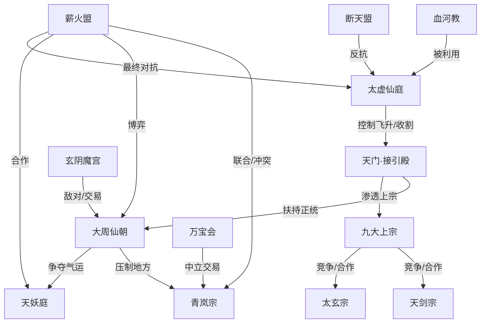

# 《照骨问仙》势力分布图

> 用于快速查看世界中的主要势力、层级与相互关系。

---

## 势力层级说明

### 最高层
- **太虚仙庭**：终极压迫秩序，控制飞升与资源流向。

### 中间层
- **天门 / 接引殿**：执行收割与筛选。
- **大周仙朝**：人间秩序强权。
- **九大上宗**：九州顶级宗门，部分被仙庭渗透。

### 地方层
- **青岚宗**：主角启蒙宗门。
- **地方世家、矿区、坊市、黑市**：前期主要冲突场。

### 反抗层
- **断天盟**：老牌反抗组织。
- **薪火盟**：主角后来建立的新型联盟。

### 其他重要力量
- **天妖庭**：与人族冲突，也可在更大危机前合作。
- **玄阴魔宫、血河教**：魔道与血祭势力。
- **万宝会**：中立交易与情报网络。

---

## 势力关系简表

| 势力 | 立场 | 与主角关系 |
|---|---|---|
| 太虚仙庭 | 终极压迫秩序 | 最终敌人 |
| 接引殿 | 仙庭执行机构 | 高压敌对 |
| 大周仙朝 | 秩序强权 | 博弈、合作、冲突并存 |
| 青岚宗 | 地方宗门 | 启蒙地，也有压迫 |
| 九大上宗 | 顶级宗门 | 拉拢、压制、竞争 |
| 天妖庭 | 妖族联盟 | 先敌后合作 |
| 玄阴魔宫 | 魔道势力 | 敌对与合作并存 |
| 血河教 | 血祭邪教 | 敌对 |
| 万宝会 | 商业中立 | 交易与情报 |
| 断天盟 | 反抗组织 | 合作但有分歧 |
| 薪火盟 | 主角阵营 | 主角建立 |

---

*可直接作为世界观势力总控图使用。*
