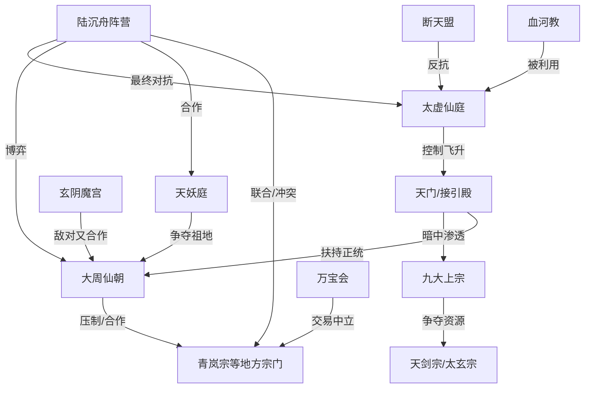

# 《照骨问仙》长篇小说详细大纲

> **类型定位**：东方玄幻 / 修仙 / 凡人流 / 热血升级 + 群像权谋 + 世界真相流
>
> **预计篇幅**：约 1000 章，280 万—320 万字，十二卷
>
> **一句话故事**：天赋被废的白石镇少年陆沉舟，得到一盏能“照见功法缺陷”的青铜残灯，从矿区杂役一路成长为能改写九州修行秩序的人，最终发现所谓飞升，不过是上界对下界修士的收割骗局。
>
> **核心主题**：力量不是特权，而是责任；真正的长生，不是一人登天，而是让后来者也有路可走。
>
> **文风基调**：前期生存压力强、中后期格局打开；爽点密集但不降智，反派有立场、有手段、有成长。

---

# 第一部分：基础世界观设定

## 1. 书名与风格定位

### 书名备选

1. **《照骨问仙》**（主推）：突出金手指“照骨灯”与问道路线。
2. 《我以残灯照万法》：突出功法推演与修行感。
3. 《仙道薪火》：突出终局主题与传承感。
4. 《葬山少年》：突出开篇氛围，但后期格局略窄。
5. 《天门之后无真仙》：突出世界观悬疑和反飞升设定。

### 风格定位

- **主风格**：热血升级流 + 群像权谋流。
- **辅风格**：前期凡人流生存感，中期宗门与王朝权谋，后期世界真相与秩序重构。
- **剧情侧重**：升级、破案、夺宝、战场、势力博弈并行，不做单纯打怪换地图。

### 避雷原则

1. 不强行降智：所有重要反派都具备信息、资源、目标与风险控制。
2. 不无脑打脸：冲突必须建立在立场、利益或信息差上，不为了羞辱而羞辱。
3. 不无限开挂：金手指只能帮助“理解和推演”，不能直接凭空造出结果。
4. 不突然换主题：从开篇就埋下“资源垄断、飞升真相、秩序之争”三条线。
5. 不让配角工具人化：重要配角均有自己的目标、错误、成长与结局。

---

## 2. 修炼体系

## 2.1 通用境界表

> 本体系强调“境界越高，生命形态、感知方式和社会责任越不同”，避免只堆数值。

| 序号 | 境界 | 阶段 | 核心能力 | 突破条件 | 寿命上限 | 社会地位 |
|---|---|---|---|---|---|---|
| 1 | 炼气境 | 一至九层 | 引气入体、强化五感、施展基础术法 | 打通十二正经与任督，完成气感循环 | 120 年 | 凡人中的强者、宗门底层弟子 |
| 2 | 筑基境 | 初/中/后/圆满 | 真气液化、可御器短途飞行、识海初开 | 压缩气海，铸就道基；道基品质分九品 | 200—260 年 | 外门精英、小城供奉 |
| 3 | 金丹境 | 九转 | 丹成神通生、真元外放、寿元大增 | 精气神合一凝丹，丹纹必须完整 | 500—800 年 | 一宗长老、地方霸主 |
| 4 | 元婴境 | 初/中/后/圆满 | 神魂化婴、短暂离体、重塑肉身局部 | 破丹成婴，经历心魔拷问 | 1200—1800 年 | 大派掌权者、王朝柱石 |
| 5 | 化神境 | 三灾九难 | 神念沟通法则、形成个人法域 | 将自身意志凝为神格雏形，渡过三灾 | 3000 年左右 | 一域巨头、规则制定者 |
| 6 | 炼虚境 | 洞虚/融虚/返虚 | 短暂遁入虚空、炼化空间碎片 | 感悟虚空结构，抵御虚空侵蚀 | 6000 年左右 | 跨州势力老祖 |
| 7 | 合体境 | 身合/神合/道合 | 肉身、神魂、大道高度统一 | 找到适合自己的“道”并承担其代价 | 1 万年左右 | 九州顶层，开宗立派 |
| 8 | 大乘境 | 万象/归一 | 借天地之势，言出法随 | 大道与天地法则共鸣，形成稳定界域 | 3 万年左右 | 九州共主级、飞升候选 |
| 9 | 渡劫境 | 一至九重天劫 | 血肉重组、法则洗礼、半仙之躯 | 渡过对应天劫，修正道果缺陷 | 10 万年左右 | 飞升前的极限强者 |
| 10 | 真仙境（伪） | 接引仙/真仙 | 受仙庭法则加持，近乎不死 | 通过“天门接引”，获得仙籍 | 理论上长生 | 下界修士眼中的终点，实则被控制 |
| 11 | 道君境（隐藏） | 自证大道 | 可在虚空开辟稳定小界，不受仙庭节制 | 拒绝仙籍、另立道统 | 随大道而存续 | 被仙庭刻意抹去的存在 |

### 2.2 补充设定：为什么飞升不是终点

- 公开认知：修至渡劫圆满，叩开天门，便可飞升成仙，长生不死。
- 真实情况：所谓仙庭是一个凌驾多界之上的古老统治体系。下界强者飞升后，大多数会被“洗魂”，炼成道兵、仙奴、法则燃料。
- 极少数真正保持自我的飞升者，也会被迫加入仙庭秩序，成为维持体系的零件。
- 因此，本书的最终矛盾不是“主角能不能变强”，而是“强者能否摆脱更高层秩序对世界的收割”。

---

## 3. 世界架构

## 3.1 位面层级

### 第一层：人界（玄苍界）

- 主舞台，包含九州、四海、荒原、归墟。
- 灵气浓度正在缓慢衰退，修士普遍以为是天地周期，实际是天门持续抽取世界本源。

### 第二层：灵界（碎星海）

- 多个破碎小世界围绕空间海运转。
- 资源丰富，但环境危险，常有空间潮汐。
- 这里保存着许多被仙庭吞并世界的残骸，是中期探索和真相揭露的重要地图。

### 第三层：仙界（太虚仙庭）

- 不是自然形成的大世界，而是一座横跨虚空的巨型道器与统治机器。
- 分为三十三重仙域，不同仙域由不同仙尊或古族掌控。
- 仙庭通过“天门—接引殿—飞升台”控制下界强者。

### 第四层：神界（原初祖庭，传说层）

- 只在上古石刻和残卷中出现。
- 传说万道源头、真正自由修行者的故乡。
- 终局不会简单进入神界，而是揭示“神界早已崩毁，仙庭不过是在模仿神界秩序”。

## 3.2 飞升与穿越规则

1. 人界修士飞升，必须通过天门认证。
2. 天门本质是筛选器：判断目标是否适合被仙庭利用。
3. 灵界可通过大型跨界阵、空间裂缝、古传送台进入。
4. 仙庭能向下投放“赐福”“仙谕”和接引使者，但不能随意全面降临，因为跨界消耗巨大。
5. 道君境强者可绕开天门，自建通道，这也是仙庭最忌惮的存在。

---

## 4. 地图与资源分布

## 4.1 玄苍界九州

1. **青州**：主角起点，山脉众多、灵药丰富，宗门林立。
2. **中州**：大周仙朝所在，政治与气运中心。
3. **云州**：剑修圣地，万剑天谷所在地。
4. **雷州**：雷泽遍地，炼体与雷法昌盛。
5. **荒州**：人妖混居，保存上古遗迹和断代历史。
6. **海州**：群岛与海族割据，海上贸易繁荣。
7. **炎州**：火山连绵，丹宗、器宗集中。
8. **幽州**：阴脉汇聚，鬼修、魂修活跃。
9. **灵州**：灵植最盛，实则为仙庭在人界最深的布局地。

## 4.2 重要资源与禁地

### 灵脉

- 灵脉分黄、玄、地、天、祖五阶。
- 灵脉不是单纯资源点，也会影响附近凡人的寿命、作物、矿藏和气候。

### 秘境

- **青木秘境**：第一卷宗门考核地，藏有守灯人遗迹。
- **黑水泽**：第二、三卷关键地点，无面疫与接引实验发生地。
- **雷泽古地**：第五卷主角炼体与争夺雷道传承之地。
- **归墟海眼**：第八卷揭示世界之心与仙庭收割史。
- **界外战场**：第十卷之后主战场，充满上古强者残骸。

### 禁地

- **葬山**：开篇核心禁地，埋有照骨灯、道骨旧案和断天之战线索。
- **天渊**：传说通往神界，实际是世界壁垒破裂处。
- **锁仙原**：古战场，飞升者尸体堆积之地。

---

## 5. 势力格局

## 5.1 正道宗门

### 青岚宗

- **地盘**：青州。
- **理念**：守正持中，强调宗门延续优先。
- **定位**：主角启蒙之地，也是“规则压迫下的妥协者”样本。
- **矛盾**：掌门岳镇岳既想护宗，又长期向更高势力输送弟子。

### 天剑宗

- **地盘**：云州。
- **理念**：以剑问道，强者至上。
- **与主角关系**：中期重要盟友兼竞争者。

### 太玄宗

- **地盘**：中州。
- **理念**：维护九州正统，拥护仙朝秩序。
- **定位**：保守派上宗，制度既得利益者。

## 5.2 魔道势力

### 玄阴魔宫

- **地盘**：幽州。
- **理念**：顺者为凡，逆者为魔，主张以力量和欲望打破伪善。
- **特点**：并非纯恶，内部也分掠夺派、学术派、复仇派。

### 血河教

- **地盘**：幽州、荒州边界。
- **理念**：以血祭、夺舍、献祭追求速成。
- **定位**：前期高压反派，后期揭示其被仙庭利用。

## 5.3 妖族势力

### 天妖庭

- **地盘**：荒州深处与部分海域。
- **理念**：人族占据灵脉太久，妖族要争回祖地。
- **关系**：与人族敌对，但在面对仙庭收割时有合作空间。

## 5.4 皇朝势力

### 大周仙朝

- **地盘**：中州，影响九州。
- **理念**：以国运御万法，建立大一统修行秩序。
- **统治者**：大周皇室、太子姬无极。
- **定位**：既是对抗混乱的制度力量，也是压迫个体和宗门的强权机器。

## 5.5 散修联盟

### 万宝会

- **地盘**：各州坊市、黑市、海运节点。
- **理念**：以交易和契约立国，利益优先。
- **作用**：信息、物资、灰色势力的通道。

## 5.6 隐藏势力

### 断天盟

- 由上代守灯人、失败飞升者和反抗者后裔组成。
- 目标：推翻仙庭控制，打开真正修行道路。
- 内部分为温和派与激进派。

---

## 6. 势力关系总图

---

## 7. 核心规则与天道法则

## 7.1 因果律

- 修仙不是“想干什么就干什么”，强者每一次夺宝、杀人、改命，都会留下因果痕迹。
- 高阶修士能屏蔽低阶窥探，但无法彻底抹掉因果，只能转移或延迟代价。

## 7.2 轮回观

- 普通修士死后神魂归于天地，强者可保留记忆碎片。
- 真正意义上的“完整复活”几乎不可能，除非以极高代价从时间长河中捞人。

## 7.3 功德与气运

- 功德不是道德积分，而是“行为对世界稳定的增益”。
- 气运则是世界对某个势力、族群、秩序的倾斜。
- 仙朝靠气运稳固统治，宗门靠气运延续道统。

## 7.4 天劫

- 天劫不是单纯惩罚，而是世界对“异常强者”的自我校正。
- 如果某个强者开始破坏世界底层规则，天劫会变得更猛烈。

## 7.5 修炼禁忌

1. **心魔**：不是外部邪祟，而是修士认知与欲望冲突形成的反噬。
2. **夺舍**：成功率低，且会残留因果污染。
3. **血祭**：短期收益高，长期必然引来天道反弹与神魂畸变。
4. **强行跨界**：会造成空间裂缝，反噬所在世界。
5. **禁术传承**：大多数禁术都来自仙庭投下的“诱导性知识”，目的是让下界修士自毁。

---

## 8. 特殊设定：金手指与血脉

## 8.1 主角金手指：照骨灯

### 外观

- 青铜古灯，只剩三分之二的灯身。
- 灯焰平常呈灰白色，像随时会熄灭。

### 本质

- 上古“薪火七器”之一，曾用于记录道法、照见缺陷、传递火种。
- 不是单纯外挂，而是一件与“传承”和“认知”有关的世界级古物。

### 核心能力

1. **照缺**：看见功法、丹药、阵法、法器中的缺陷。
2. **溯痕**：读取物品残留的信息和使用痕迹。
3. **演法**：基于已有知识推演新的修炼路径。
4. **存火**：保存主角真正理解的道法，形成“薪火书页”。
5. **照心**：照见自身执念和谎言，防止走火入魔。
6. **传薪**：在自愿前提下共享修行感悟。
7. **燃界**：终极能力，唤醒世界自我修复机制。

### 使用限制

- 只能解析主角亲自接触过、观察过、理解过的东西。
- 推演需要消耗灯油，灯油来自“悟道薪火”和他人自愿产生的愿火。
- 推演不出“最完美答案”，只能给出数条可行路径，选择仍靠主角。
- 过度使用会损伤神魂，出现失忆、幻听、情绪迟钝。
- 面对远超自身境界的存在，只能感到危险，看不到具体内容。

---

# 第二部分：主角与核心角色

## 9. 主角设定

### 基础信息

- **姓名**：陆沉舟
- **性别**：男
- **开篇年龄**：16 岁
- **出身**：青州白石镇采药户之子
- **初始身份**：被判定为“废灵根”的凡人少年
- **性格底色**：谨慎、克制、能忍、重承诺、对弱者有天然共情
- **表层目标**：治好妹妹、活下去、进入宗门
- **中期目标**：查清父母失踪与自己道骨被夺真相
- **终极目标**：打破飞升骗局，重建不被上界收割的修行秩序

### 金手指获得方式

- 开局为救妹妹深入葬山，在尸坑中发现照骨灯。
- 照骨灯并非认主系统，而是在主角“宁愿冒死也要救别人”的瞬间被触发。
- 它不是天降捷径，而是把主角推向更高风险。

### 初始困境

1. 妹妹病重，家里没有钱。
2. 父亲留下的升仙令被赵家夺走。
3. 灵根残缺、经脉受损，无法正常修行。
4. 白石镇被赵家和镇守仙师联手控制。

### 主角缺陷

- 太习惯把风险留给自己。
- 对权威天然不信任，初期不擅长合作。
- 由于能看见缺陷，容易忽视别人的优点。
- 情感表达笨拙，害怕承诺做不到。

### 人物弧光

- **前期**：为了活下去而学会算计。
- **中期**：为了保护同伴而学会建立秩序。
- **后期**：为了更多人能活而有资格选择，学会放弃绝对控制。

---

## 10. 成长弧线

| 阶段 | 主要身份 | 核心能力变化 | 性格变化 | 认知升级 |
|---|---|---|---|---|
| 1—100章 | 小镇少年/宗门杂役 | 靠观察、药理、基础符箓求生 | 从隐忍到敢争 | 规则可以被利用，但不能全靠运气 |
| 100—300章 | 外门弟子/初露锋芒 | 功法修正、阵法组合、筑基成功 | 更冷静，更有担当 | 宗门不是庇护所，也是利益机器 |
| 300—500章 | 一宗核心/联盟发起人 | 金丹成就、组建人脉 | 开始承担公共责任 | 强者不只是能赢，还要能分配代价 |
| 500—700章 | 九州级人物 | 元婴、化神，建立薪火盟 | 从复仇者变成秩序缔造者 | 世界真相远比正邪对立复杂 |
| 700—850章 | 诸界联合者 | 合体、大乘、跨界布局 | 学会合作、妥协、授权 | 推翻压迫不等于自动得到好结果 |
| 850—1000章 | 新道开创者 | 渡劫、触道君门槛 | 从掌控一切到允许反对 | 真正的长生是制度与文明延续 |

---

## 11. 女主设定：宁知微

### 基础信息

- **身份**：青岚宗执法峰弟子，后揭示为大周宁王遗孤。
- **性格**：冷静、原则感强、克制、外冷内热。
- **修炼方向**：冰系剑修，主修《明镜剑典》。
- **核心能力**：能感知誓言是否违背本心，但不等于读心。

### 情感线发展节点

1. **相识**：第一卷矿难调查中，双方互相试探。
2. **并肩**：黑水泽共同查案，建立初步信任。
3. **分歧**：主角多次隐瞒灯的反噬，宁知微认为自己被排除在风险之外。
4. **共担**：归墟卷后，两人确立“重大风险必须共享”的关系原则。
5. **成熟**：终局时不是“主角的女人”，而是共同制定规则的人。

### 对主角成长的影响

- 让主角意识到：真正信任不是独自扛住，而是允许别人参与决策。
- 让主角学会在效率与公正之间做平衡。

---

## 12. 挚友与核心伙伴

### 12.1 韩铁衣

- 铁匠之子，土火双灵根，炼器师与体修。
- 外表粗犷，实际心思细，最懂底层修士的生存难处。
- 作用：负责武器、工坊、后勤、基层组织。
- 结局：建立跨界百工院，让“技术”成为新秩序支柱。

### 12.2 苏晚禾

- 药童出身，木灵根，丹道天赋极高。
- 温和但固执，反对以人试丹。
- 作用：建立平价药修体系，破解丹毒垄断。
- 结局：创建世界种子库和医修网络。

### 12.3 商九歌

- 散修情报商，断天盟后裔。
- 表面圆滑逐利，实际背负家族使命。
- 作用：负责情报、交易、游说、灰色行动。
- 结局：牺牲家族特权，换取诸界信息共享。

### 12.4 灰爷

- 灰毛獾，实为负山兽后裔。
- 嘴碎、贪吃、怕死，但关键时刻从不缺席。
- 作用：喜剧缓冲 + 空间天赋 + 战斗辅助。
- 结局：成为负责迁移濒危小世界的“负山尊者”。

---

## 13. 导师/引路人：裴守拙

- **身份**：青岚宗藏经阁看守，前代宗主候选。
- **性格**：沉稳、克制、说话慢，但判断极准。
- **作用**：教主角最重要的不是功法，而是“如何判断一部功法是否在骗人”。
- **退场时机**：第三卷为保护弟子和公开真相战死。
- **人物遗产**：守拙三问贯穿全书。

### 守拙三问

1. 此法从何而来？
2. 此法让谁得利？
3. 此法代价由谁承担？

---

## 14. 反派与宿敌体系

## 14.1 第一层：地方压迫者——赵元魁

- 白石镇赵家少主，夺走主角升仙令。
- 特点：不蠢，懂人情、会借势、擅长钻规则空子。
- 作用：主角早期镜像——同样出身小地方，却选择踩着别人往上爬。
- 结局：后期有一次真正的选择，但不是洗白成好人。

## 14.2 第二层：宗门妥协者——岳镇岳

- 青岚宗掌门。
- 动机：为了宗门延续，可以接受牺牲少数弟子。
- 特点：并不享受作恶，但相信“现实只能这样”。
- 结局：在主角逼出更高真相后，选择以死赎罪。

## 14.3 第三层：秩序强权者——姬无极

- 大周太子，帝王道体。
- 动机：建立统一秩序，集中资源抵御世界衰退。
- 冲突：他欣赏主角，却不能容忍不受控制的变量。
- 结局：战死后完成从控制者到守门人的转变。

## 14.4 第四层：激进救世者——闻人烬

- 断天盟副盟主。
- 动机：确认仙庭骗局后，主张献祭一州强行催生道君。
- 特点：不是疯子，而是把“效率”推到极端的人。
- 结局：最终承认自己不愿再让别人替自己牺牲。

## 14.5 终极反派：太一仙尊

- 仙庭建立者之一。
- 动机：恐惧死亡、恐惧混乱、恐惧自由意志带来的战争。
- 立场：认为永恒秩序优于充满风险的自由。
- 终局：不是被主角简单杀死，而是在“道路之争”中被击败。

---

# 第三部分：主线剧情框架

## 15. 开篇钩子

### 主角初始困境

- 妹妹病重，药费高昂。
- 父亲留下的升仙令被夺。
- 自己被判定为废灵根。
- 白石镇资源被赵家与镇守仙师垄断。

### 金手指觉醒方式

- 为救妹妹入葬山，得到照骨灯。
- 第一次使用照骨灯，发现药材、功法、经脉中的缺陷。
- 但金手指没有直接救他，只是让他在绝境中多了一线生机。

### 第一个小目标

- 活过七天，治好妹妹，夺回属于自己的入门资格。

---

## 16. 核心冲突

### 表层冲突

- 赵家欺压、宗门内斗、资源垄断、天才竞争。

### 中层冲突

- 大周仙朝与宗门、妖族、魔道、散修之间的秩序之争。

### 深层冲突

- 仙庭对下界修士的收割与控制。
- 主角要对抗的不是某个坏人，而是一整套“强者必须被更高者收编”的制度。

### 主角个人目标与主线关联

- 开局是为自己和妹妹活下去。
- 中期是为师父、同伴、家乡讨回公道。
- 后期是为整个玄苍界争一条不被收割的路。

---

## 17. 前期（1—100章）：新手村与宗门立足

### 主要内容

- 白石镇求生。
- 葬山得灯。
- 夺回升仙令。
- 进入青岚宗。
- 药庐、矿区、外门三重磨练。
- 揭露矿场血祭案。

### 关键节点

- 1—10章：获得金手指，建立生存压力。
- 11—25章：智斗赵家，夺回机会。
- 26—50章：入宗、识人、站稳。
- 51—75章：矿难副本，第一次真正生死战。
- 76—100章：外门立足，牵出宗门黑幕。

---

## 18. 中期（100—500章）：势力崛起与九州扬名

### 主要内容

- 宗门内卷、外门大比、秘境夺宝。
- 黑水泽查案，裴守拙战死。
- 青岚宗改革，主角从弟子变为领袖。
- 中州问道会，接触九州顶层力量。
- 建立薪火盟，公开飞升真相。

### 关键节点

- 100—180章：外门大比、功法体系成型。
- 180—260章：黑水泽与守灯人旧案。
- 260—340章：宗门内乱与改革。
- 340—440章：青州逐鹿，学会联盟战争。
- 440—500章：中州问道，金丹成就，天下皆知。

---

## 19. 后期（500—800章）：真相揭露与最终铺垫

### 主要内容

- 飞升骗局公开，天下动荡。
- 九州三方大战。
- 归墟探索，世界之心现身。
- 天门防线建立。
- 诸界联系开始。

### 关键节点

- 500—600章：真相冲击、信仰崩塌。
- 600—700章：归墟心魔与感情线深化。
- 700—800章：九州统一战线，登仙台改造。

---

## 20. 结局（800—1000章）：终战与新秩序

### 主要内容

- 界外战场。
- 诸界联合。
- 仙庭真相彻底揭开。
- 主角拒绝成为新的独裁者。
- 建立薪火公议与新修行秩序。

### 结局方式

- 主线矛盾解决：打破仙庭垄断，建立分布式、可质疑、可退出的秩序。
- 主角归宿：境界主动跌落，保留人性与自由，回到青州重建传法体系。
- 世界观收尾：不再是“飞升即终点”，而是“万界互通、秩序共修”。

---

# 第四部分：分卷详细大纲

## 第一卷：葬山残灯（1—75章）

### 卷目标

完成主角从凡人到炼气后期的起步，建立金手指、世界观底层矛盾和第一个大悬念。

### 主线内容

1. 黑雨落葬山，主角为救妹妹入山。
2. 得到照骨灯，发现父亲旧案线索。
3. 夺回升仙令，进入青岚宗。
4. 在药庐、矿区、外门中生存。
5. 发现矿场血祭，救出被当作耗材的杂役。
6. 牵出掌门一脉与更高势力的交易。

### 卷末高潮

- 矿洞崩塌，主角点亮第一道火纹，带二十余名杂役生还。

### 卷末反转

- 真正主谋不是矿区管事，而是宗门更高层。

---

## 第二卷：青岚外门（76—155章）

### 卷目标

完成主角从“被利用者”到“外门有力竞争者”的转变。

### 主线内容

1. 进入外门，建立朋友圈与敌对关系。
2. 通过藏经阁学习，修复功法缺陷。
3. 揭露丹药掺假与外门剥削链。
4. 青木秘境夺宝，发现守灯人遗迹。
5. 裴守拙开始正式传授“看问题的方式”。

### 卷末高潮

- 外门大比击败赵元魁，但不靠数值碾压，而靠规则和准备。

---

## 第三卷：黑水夜行（156—245章）

### 卷目标

扩大地图，建立断天盟、接引殿、守灯人历史三条线。

### 主线内容

1. 黑水泽查无面疫。
2. 发现接引实验与宁知微师兄旧案。
3. 裴守拙现身护弟子，揭开青岚宗旧案。
4. 主角第一次真正直面“宗门也能作恶”的现实。

### 卷末高潮

- 裴守拙战死，主角完成精神上的第一次成人礼。

---

## 第四卷：一宗兴亡（246—340章）

### 卷目标

让主角完成从“修士”到“组织者”的转变。

### 主线内容

1. 接引殿清洗青岚宗。
2. 主角在祖师禁地获得更高传承。
3. 联合矿工、药农、外门弟子守山。
4. 岳镇岳以死补过，青岚宗旧秩序瓦解。

### 卷末高潮

- 主角拒绝当宗主，提出议事堂与公开功勋制度。

---

## 第五卷：青州逐鹿（341—440章）

### 卷目标

让主角真正理解战争、联盟、民心和代价分配。

### 主线内容

1. 青州诸宗博弈。
2. 与大周、接引殿、地方世家全面冲突。
3. 赵元魁成长为真正的对手。
4. 主角以轮转大阵守住青州。

### 卷末高潮

- 姬无极抛出中州问道邀请，危险与机遇并存。

---

## 第六卷：中州问道（441—545章）

### 卷目标

让主角进入九州核心舞台，完成“地方天才”到“天下人物”的跃迁。

### 主线内容

1. 天京权谋与书院辩论。
2. 九大上宗拉拢与压制。
3. 主角建立“百家道藏”的雏形。
4. 发现皇室与道骨旧案的直接关联。
5. 成就九纹金丹，天下震动。

### 卷末高潮

- 主角在登仙台公开飞升者被炼成道兵的影像。

---

## 第七卷：九州风雷（546—650章）

### 卷目标

检验“公开真相”之后的责任与后果。

### 主线内容

1. 真相扩散，信仰崩塌。
2. 薪火盟成立，内部也出现投机与争权。
3. 妖族、仙朝、断天盟多方角力。
4. 主角失去一次击杀姬无极的机会，但保住更多无辜者。

### 卷末高潮

- 姬无极主动交出主角被夺道骨，揭示更大难题。

---

## 第八卷：归墟照心（651—745章）

### 卷目标

以探索、心魔、感情深化为主，完成主角精神结构升级。

### 主线内容

1. 归墟海眼探索。
2. 见到多个毁灭世界的残片。
3. 直面“如果我也变成太一仙尊会怎样”的恐惧。
4. 建立与宁知微真正平等的关系模式。

### 卷末高潮

- 主角发现世界只剩三百年寿命，仙庭即将提前大收割。

---

## 第九卷：天门之前（746—850章）

### 卷目标

完成九州统一战线，真正把“反抗仙庭”从口号变成战争准备。

### 主线内容

1. 改造登仙台。
2. 与姬无极合作、斗争、再合作。
3. 闻人烬激进献祭被阻止。
4. 赵元魁完成最后一次选择并死亡。

### 卷末高潮

- 登仙台从“抽取世界的漏斗”变成“反攻天门的通道”。

---

## 第十卷：界外烽火（851—945章）

### 卷目标

将冲突升级到下界与仙庭的正面对抗。

### 主线内容

1. 穿过天门，进入界外战场。
2. 发现父亲陆归山被炼成道兵。
3. 太一仙尊首次正面阐述“秩序永生”理念。
4. 薪火盟内部出现“接受仙庭庇护”的分歧。

### 卷末高潮

- 主角亲手送别父亲，同时意识到仙庭内部也有被压迫者。

---

## 第十一卷：诸界薪火（946—1050章）

### 卷目标

证明主角的方案不只是反抗，而是可执行的新秩序。

### 主线内容

1. 联合多个被收割世界。
2. 试验“诸界薪火网”。
3. 遭遇失败、质疑、声誉下跌。
4. 七器齐聚，证明分布式秩序可以抵御归寂潮。

### 卷末高潮

- 姬无极战死，七器齐鸣，诸界第一次真正联手。

---

## 第十二卷：人间新火（1051—终章）

### 卷目标

完成终局对决、制度重建与主题收束。

### 主线内容

1. 主角拒绝继承仙庭独裁权柄。
2. 与太一仙尊进行法术、制度、道路三层对决。
3. 燃界发动，唤醒世界自我修复能力。
4. 建立薪火公议，让所有世界拥有退出和修改规则的权利。
5. 主角跌境归乡，重建传法体系。

### 终章画面

- 白石镇学堂里，一个无灵根孩子指出功法错误。
- 陆沉舟点亮一盏普通油灯，说：“那就改。道法从来不是祖宗留下来不许动的东西。”

---

# 第五部分：节奏与伏笔设计

## 21. 节奏把控

### 每 50 章一个关键节点

- **50章**：入宗站稳，矿难案爆发。
- **100章**：外门大比结束，宗门黑幕露头。
- **150章**：守灯人遗迹确认，黑水泽线开启。
- **200章**：裴守拙牺牲，主角真正背负使命。
- **250章**：青岚宗改革开始。
- **300章**：青州战争全面爆发。
- **350章**：中州线开启，姬无极登场加深。
- **400章**：百家道藏成型，主角金丹。
- **450章**：飞升真相首次公开。
- **500章**：天下震荡，薪火盟建立。
- **550章**：九州大战，阵营重组。
- **600章**：归墟篇开启，心魔与感情深化。
- **650章**：世界寿命危机揭示。
- **700章**：九州防线与登仙台改造。
- **750章**：天门战争打响。
- **800章**：界外战场，父亲真相揭晓。
- **850章**：诸界联合试验失败再成功。
- **900章**：姬无极终局，七器合一。
- **950章**：仙庭总攻，太一仙尊现身。
- **1000章**：新秩序建立，主角归隐。

### 爽点分布

- 每 1—2 章一个小爽点：识破骗局、反制压迫、战斗逆转。
- 每 8—12 章一个中爽点：夺宝、晋升、当众破局。
- 每 50 章一个大爽点：大比胜利、卷级反转、真相揭露。
- 每 100 章一个主题级爽点：秩序重构、联盟成立、制度胜利。

### 泪点分布

- 裴守拙之死。
- 主角父亲道兵结局。
- 赵元魁最后一次选择。
- 姬无极之死。
- 主角拒绝独裁后跌境归乡。

---

## 22. 伏笔与呼应

| 伏笔 | 埋设位置 | 回收位置 | 作用 |
|---|---|---|---|
| 黑雨中的银色尘埃 | 第1章 | 第六卷/第十卷 | 指向仙庭收割与天门污染 |
| 主角肩骨黑钉 | 第1章 | 第七卷/终局 | 连接道骨被夺与接引印 |
| 父亲旧账册 | 第6章 | 第三卷/第十卷 | 揭开守灯人与道兵真相 |
| 青木秘境守灯人遗迹 | 第二卷 | 第八卷 | 连接薪火七器 |
| 裴守拙三问 | 第二卷 | 全书 | 主角判断制度的核心方法 |
| 登仙台异常 | 第四卷 | 第九卷 | 揭示天门抽取世界本源 |
| 姬无极的秩序理想 | 第六卷 | 第十一卷 | 从压迫者到守门人的弧光 |
| 归墟世界残片 | 第八卷 | 终局 | 证明仙庭不是唯一秩序 |
| 照骨灯第七纹 | 第一卷暗示 | 终章 | 燃界与新秩序启动 |

---

# 第六部分：前30章逐章细纲

## 第1章：黑雨落葬山

- 白石镇突降黑雨，药田腐烂，妹妹陆小满病重。
- 陆沉舟为采赤须参冒险入山。
- 在葬山尸坑发现青铜残灯。
- **章末钩子**：残灯照出他肩骨中有一枚黑钉。

## 第2章：灯照骨中钉

- 陆沉舟意识到自己幼年的“病”并不简单。
- 古灯初步苏醒，显示周围灵气异常。
- 他避开赵家采药队，找到赤须参。
- **钩子**：药参旁守着一条不该出现在外围的青鳞蛇。

## 第3章：三寸生门

- 主角利用蛇的旧伤与盲区采药成功。
- 古灯提示药性受损，需要配伍。
- **钩子**：他把药带回去，却面临赵家更紧的逼迫。

## 第4章：一碗救命药

- 陆沉舟谨慎试药，救回妹妹。
- 老药师震惊，认出陆父留下的玉牌。
- **钩子**：玉牌显现“青岚”二字。

## 第5章：被夺走的升仙令

- 赵家逼宫，要求交出升仙令。
- 主角表面退让，暗中留证。
- **钩子**：他发现赵家早已接触过父亲遗物。

## 第6章：旧伤与旧账

- 陆沉舟找到账册，怀疑道骨被夺。
- 他开始意识到自己的废灵根可能不是天生。
- **钩子**：账册签字者来自镇守仙师。

## 第7章：先学会输

- 主角主动找赵元魁谈判，故意暴露一部分抄本。
- 赵元魁没有立刻杀他，而是先查来源。
- **钩子**：赵家深夜搜家。

## 第8章：空匣计

- 主角用空匣误导赵家，并把账册拆散藏好。
- 他第一次用信息备份换取安全。
- **钩子**：真正的账册夹层掉出葬山地图。

## 第9章：父母最后去处

- 地图指向父母失踪前的路线。
- 妹妹透露母亲当年曾警告他不要去中州。
- **钩子**：升仙初试突然提前。

## 第10章：一拳之前

- 初试第一关，主角用规则和观察赢过赵家护院。
- 他夺回了自己的升仙资格。
- **钩子**：镇守仙师宣布还有第二关。

## 第11章：第二关，问心路

- 主角面对幻阵与威压测试，照骨灯出现微弱波动。
- 他没有靠蛮力，而是识破阵眼。
- **钩子**：阵中出现不属于青州的银色符纹。

## 第12章：入山资格

- 陆沉舟获得入宗资格，却被分到最差的杂役路线。
- 他接受现实，因为目标是活下去。
- **钩子**：药庐执事对他格外关注。

## 第13章：药庐第一天

- 主角进入青岚宗药庐，见识宗门底层生态。
- 他第一次意识到宗门内部同样有剥削。
- **钩子**：药庐里有人私换药材。

## 第14章：假丹与真命

- 主角凭照骨灯看出丹药问题，避免同屋弟子中毒。
- 他因此得罪丹房小管事。
- **钩子**：那批假丹来自外门某位执事。

## 第15章：第一笔交易

- 主角用辨药能力换取修炼资源。
- 他学会在规则内积累筹码。
- **钩子**：有人盯上他的“辨药术”。

## 第16章：藏经阁外的老人

- 主角初遇裴守拙。
- 老人没有教他神通，只问他一句：“你学的功法，谁得利？”
- **钩子**：裴守拙似乎认识陆父。

## 第17章：灵根测试

- 主角被正式判定为废灵根，众人嘲笑。
- 他没有崩溃，而是决定另辟蹊径。
- **钩子**：照骨灯提示他的灵根并非废，而是“空”。

## 第18章：外门最差的活

- 主角被分去矿区做杂役。
- 他第一次见识真正的生死压迫。
- **钩子**：矿洞里有人失踪。

## 第19章：七号废矿

- 七号矿危险、死人、没人愿意去。
- 主角却被安排进去。
- **钩子**：矿壁上有规律的血色纹路。

## 第20章：矿下三人

- 主角结识韩铁衣、苏晚禾。
- 三人第一次形成互信小队。
- **钩子**：矿道深处传来哭声。

## 第21章：哭声不是人

- 主角发现矿妖并非单纯吃人。
- 有人借矿妖遮掩真正的血祭。
- **钩子**：失踪者名册和十年前惊人相似。

## 第22章：低阶符箓的用法

- 主角用便宜符箓布下简易警戒。
- 他第一次展现“穷人战法”。
- **钩子**：夜里符箓全部同时熄灭。

## 第23章：第一次反杀

- 矿洞监工想灭口，主角反杀成功。
- 不是靠硬拼，而是靠环境和预判。
- **钩子**：监工身上有宗门内门令牌。

## 第24章：证据分三份

- 主角把证据分给宁知微、裴守拙和敌对管事。
- 他学会分散风险。
- **钩子**：宁知微主动找他问话。

## 第25章：执法峰来人

- 宁知微开始怀疑矿场不是妖患，而是人祸。
- 她与主角形成初步合作。
- **钩子**：师兄旧案被重新翻出。

## 第26章：山下风起了

- 赵家开始反扑，散布主角作弊的流言。
- 主角不急着辩解，而是先稳住证据链。
- **钩子**：外门大比临时改变规则。

## 第27章：规则里的刀

- 主角发现新规则专门压制杂役弟子。
- 他决定把规则也变成武器。
- **钩子**：有人给他送来一张写着“别查下去”的纸条。

## 第28章：灯油见底

- 照骨灯因连续推演而变得暗淡。
- 主角第一次意识到金手指也有代价。
- **钩子**：他开始遗忘母亲的声音。

## 第29章：废矿封洞

- 七号矿将被封死，所有证据都可能被埋掉。
- 主角决定冒险下最后一趟。
- **钩子**：矿底祭坛上摆着活人的名牌。

## 第30章：活人被写进阵里

- 主角确认这不是妖祸，而是人祭。
- 他决定救人，而不是只逃走。
- **钩子**：祭坛最深处，刻着他父亲的名字。

---

# 第七部分：支线设计

## 23. 主要支线

### 23.1 妹妹陆小满成长线

- 从被保护者成长为阵法师。
- 作用：让主角意识到“保护”不是替对方决定人生。
- 收束时机：第九卷后独立承担防线改造。

### 23.2 苏晚禾药修线

- 揭露丹药垄断与药毒问题。
- 作用：补足世界观中的民生与修炼成本。
- 收束时机：第十一卷建立跨界药库。

### 23.3 韩铁衣百工线

- 组织底层炼器师、矿工、杂役建立百工盟。
- 作用：让“普通人”也能参与秩序重构。
- 收束时机：终局建立万家灯塔。

### 23.4 商九歌情报线

- 负责消息、交易、灰色手段。
- 作用：推动断天盟、七器、诸界联系。
- 收束时机：终局切断家族特权。

### 23.5 灰爷空间线

- 负责空间节点、遗址探索、濒危世界迁移。
- 作用：缓冲沉重剧情，并在关键时刻救场。
- 收束时机：终章成为负山尊者。

---

# 第八部分：可执行写作建议

## 24. 章节写作模板

每章建议包含：

1. **本章目标**：这一章推进什么矛盾。
2. **冲突点**：谁在阻碍主角。
3. **爽点**：本章给读者什么情绪回报。
4. **信息增量**：揭示了什么新设定或新伏笔。
5. **章末钩子**：下一章必须读的理由。

## 25. 开篇写作原则

- 前3章不要讲大段历史，先让读者看见主角的困境。
- 前10章必须出现一次真正意义上的“反制成功”。
- 前30章要让读者明白：这本书不是纯打怪升级，而是“用脑子改命”。

## 26. 后续可继续细化的方向

1. 第一章细纲
2. 前十章逐章正文提纲
3. 青岚宗门派制度与人物表
4. 九大上宗与大周仙朝制度表
5. 主要战斗场景分镜
6. 伏笔回收总表
7. 每卷 50 章节奏表

---

# 第九部分：一句话总纲

**一个被夺去天赋的少年，靠一盏能照见缺陷的古灯，从被压迫者成长为规则重写者；他最终要做的，不是自己成仙，而是让整个修仙世界不再只属于少数人。**

---

*这份大纲可直接作为长篇连载的总纲使用。若需要，我可以继续基于这份大纲输出“第一章细纲”或“前100章逐章细纲”。*
